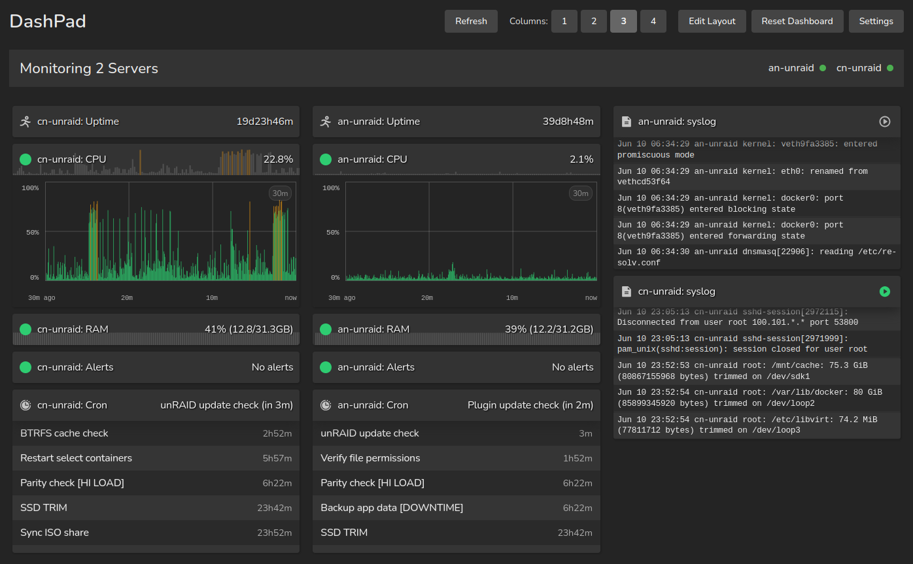

# DashPad

A modular system monitoring solution designed to repurpose old tablets as dedicated system metrics displays.

!!! abstract "IMPORTANT NOTE"
    As of June 1st, 2025, DashPad is in active, pre-release development. Since the project is created and managed by a solo developer, the primary goal is to establish a stable and coherent codebase that aligns with long-term architectural goals.
    
    Consequently, pull requests will not be reviewed or accepted at this time. The codebase is likely to undergo significant changes, and this documentation should also be considered a living document. Your interest and patience as the project matures is appreciated!

## What is DashPad?

DashPad transforms old, unused tablets (namely iPads) into real-time system monitoring displays for your servers. Built with a microservices architecture, it provides comprehensive infrastructure monitoring with minimal resource usage.

DashPad traces its origins to 2024 as a basic, single-container solution to monitor unRAID server metrics in near-real-time. The project saw major development in mid-2025 where it was used as part of an educational project. 

For the curious, you can read the final report here: [DashPad Final Report](./assets/dashpad-report-public.pdf)

### Key Features

- **Real-time Monitoring**: Updates every 2-60 seconds (configurable)
- **Tablet Optimized**: Responsive interface designed for iPad and other tablets
- **Multi-Server Support**: Monitor multiple systems from one dashboard
- **Modular Design**: Enable only the metrics you need
- **Lightweight**: Minimal resource usage on both server and tablet

!!! success "DashPad-API and DashPad-Web can be used 100% locally without a connection to the Internet."

## DashPad is for you if...

✅ You have old tablets gathering dust

✅ You want lightweight system monitoring without a database

✅ You prefer simple, visual monitoring displays

✅ You run home servers or small infrastructure 

✅ You value resource efficiency

✅ You want at-a-glance system health visibility

## DashPad is NOT for you if...

❌ You need historical data storage (at least, for more than one hour)

❌ You require complex alerting rules

❌ You want a full monitoring stack

❌ You need Windows support

❌ You require user management or multi-tenancy

❌ You need to monitor multiple dozens of servers

❌ You're uncomfortable leaving electronics on and plugged in constantly

## Architecture Overview

DashPad consists of two primary microservices:

| Component | Description | Deployment |
|-----------|-------------|------------|
| **[DashPad-API](api/index.md)** | Backend data collection service | Local server only |
| **[DashPad-Web](web/index.md)** | Frontend monitoring interface | Local or cloud |

!!! danger "IMPORTANT"
    The API container (DashPad-API) must run directly on the server being monitored, as it requires access to system directories like `/proc`. Only the Web container can be deployed to the cloud.

## Available Metrics

- **System Metrics**: CPU usage, RAM usage, system uptime
- **Log Monitoring**: Real-time system log viewing
- **Scheduled Tasks**: Cron job monitoring
- **Alerts**: Netdata integration for system alerts

## Documentation

- **[Architecture](architecture.md)** - Technical design overview
- **[API Configuration](api/configuration.md)** - Backend setup
- **[Web Configuration](web/configuration.md)** - Frontend setup
- **[API Reference](api/endpoints.md)** - Endpoint documentation

## Support

- **Documentation**: You're here! 👋
- **Source Code**: [GitHub Repository](https://github.com/mrchrisneal/DashPad)